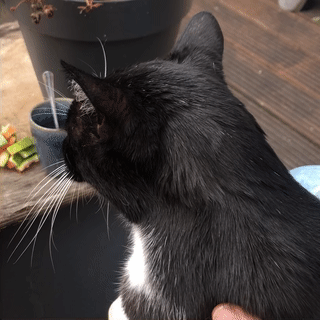

# gifify

Encode a movie file to gif, specialized for demos, feature presentations, bug reports etc.

## Install

For gifify you'll need [ffmpeg](https://ffmpeg.org/download.html) and [rust](https://www.rust-lang.org/tools/install) installed.

On mac, using homebrew:

    brew install ffmpeg rust
    cargo install gifify

## Usage

    # Creates ~/Desktop/Screen\ Recording\ 2021-12-21\ at\ 16.16.58.gif 
    gifify ~/Desktop/Screen\ Recording\ 2021-12-21\ at\ 16.16.58.mov

    # Make a webm instead of a gif.
    # Webm is much smaller than gif, but STILL not fully supported on Apple devices.
    gifify --webm Cat.mov -o canihazcheeze.webm

    # Make it a big cat gif
    gifify --big Cat.mov

    # See all available options
    gifify --help

## Mandatory cat gif

